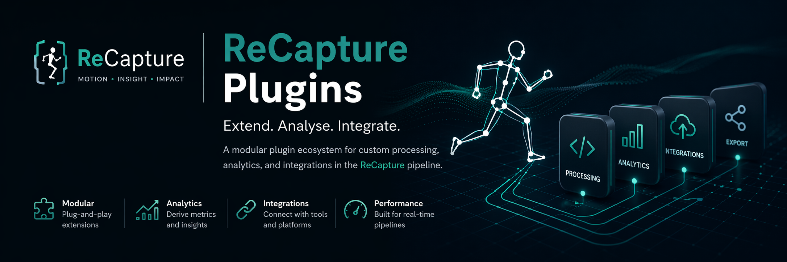

# ReCapture Plugins

Plugin ecosystem for extending ReCapture with custom processing, analytics, and graphs.

## Overview
Recapture plugins are data analysis scripts which extend the ReCapture pipeline.
They can be run from within the app, providing end users of ReCapture with biomechanical graphs, enabling insight and impact.

---

## Architecture
- **Core ReCapture Engine** → Records videos and produces motion capture data
- **Plugin Layer** → Consumes and processes data
- **Outputs** → Graphs with annotations

Plugins operate as independent units with defined inputs and outputs; each one is a python file or files operating in a specific environment.

---

## Usage in ReCapture

1. Clone this repository - `git clone https://github.com/Bath-Impact-Lab/ReCapture-Plugins`
2. Copy the contents of the `plugins/` directory into `C:/Users/<username>/Documents/ReCapture Plugins/` (creating it if it doesn't exist) 
3. Run ReCapture as normal; it will detect the plugins placed in that directory.

---

## Use Cases

- Gait analysis
- Rehabilitation metrics
- Sports performance tracking
- Real-time feedback systems
- Data export pipelines

---

## Contributing

If you are developing a plugin, see [the documentation for developing a plugin](documentation/Creating%20a%20Plugin.md). 

---

## License

See [LICENSE](LICENSE) for details.
